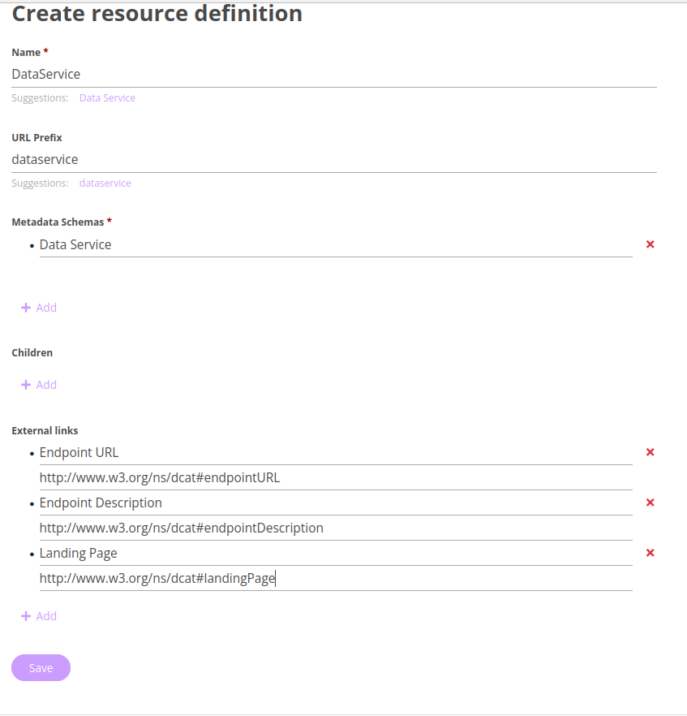
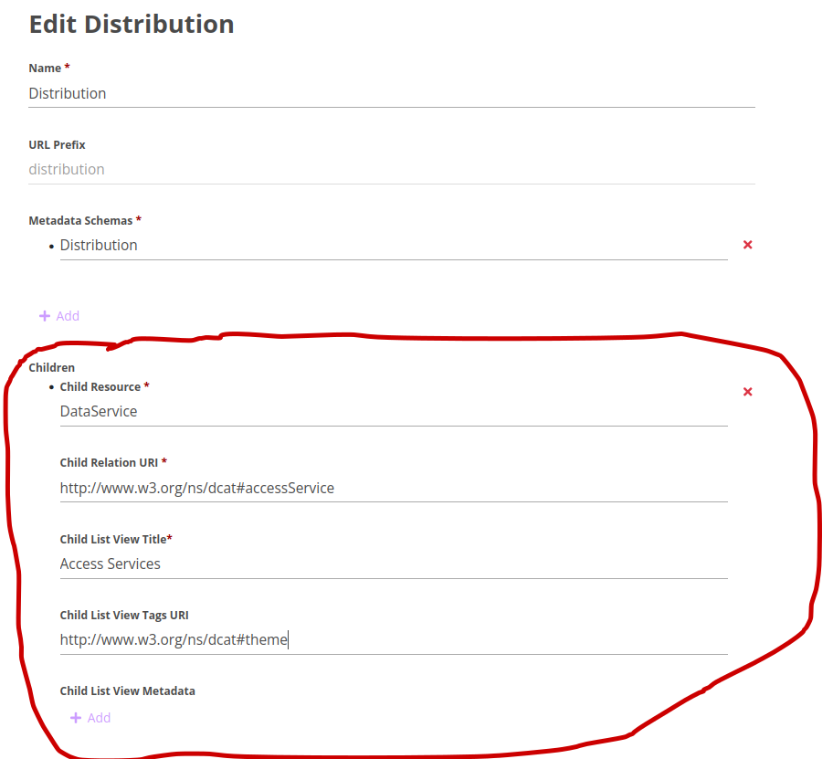

# FiaB_Masters

This is FAIR in a Box for the UPM Computational Biology Master's programme

./run-me-to-install.sh

The "masters-ready-to-go" folder will appear **in your home folder** (/home/osboxes/masters-ready-to-go)

docker-compose up, and in a minute or two, you'll be up and running!

## LOGIN NOW:

user:  albert.einstein@example.com
pass:  password

## Create new Resource Definition for Data Services

Click the "Create Resource Definition" button.

Follow the guidelines in the image below to fill the fields, then save:


```
http://www.w3.org/n/dcat#endpointURL
http://www.w3.org/ns/dcat#endpointDescription
http://www.w3.org/ns/dcat#landingPage
````


### We need to **make _DataService_ a child of Distribution**

Click the "Distribution" menu item, to begin editing it.

DCAT has defined the predicate for the relationship between a Distribution and the service that serves it:  **"dcat:accessService"**   
```
http://www.w3.org/ns/dcat#accessService
http://www.w3.org/ns/dcat#theme`
```



Save!


Done!!
